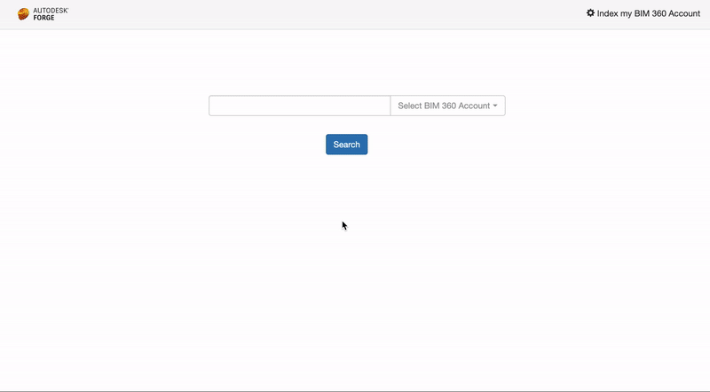

# forge-bim360search


[](http://opensource.org/licenses/MIT)

[](http://developer.autodesk.com/)
[](http://developer.autodesk.com/)
[](http://developer.autodesk.com/)

[](https://aws.amazon.com/elasticsearch-service/)
[](https://aws.amazon.com/elasticsearch-service/)


# Description

Demonstrate how to index metadata into a Elasticsearch database ([AWS Service](https://aws.amazon.com/elasticsearch-service/)) and search on it. This sample recursively iterate through all projects of the selected BIM 360 Account (Hub), then into the `Project Files` folder, then subfolders, then the last version of an item, get all the metadata and send to Elasticsearch as a text (not JSON). When a new file is uploaded, a webhook triggers and update the index. Once the index is done, one can search and redirect to the BIM 360 file.

## Thumbnail



# Setup

## Prerequisites

1. **Forge Account**: Learn how to create a Forge Account, activate subscription and create an app at [this tutorial](http://learnforge.autodesk.io/#/account/). 
2. **Visual Studio**: Either Community (Windows) or Code (Windows, MacOS).
3. **.NET Core** basic knowledge with C#
4. **ngrok**: Routing tool, [download here](https://ngrok.com/)
5. **MongoDB**: noSQL database, [learn more](https://www.mongodb.com/). Or use a online version via [mLab](https://mlab.com/) (this is used on this sample)
6. **AWS Account** with **Elasticsearch**: create or use your AWS Account, [learn more](https://aws.amazon.com/elasticsearch-service/).

## Running locally

Clone this project or download it. It's recommended to install [GitHub desktop](https://desktop.github.com/). To clone it via command line, use the following (**Terminal** on MacOSX/Linux, **Git Shell** on Windows):

    git clone https://github.com/autodesk-forge/forge-bim360search

**Amazon Elasticsearch**

Create or use your AWS Account. Go to [Elasticseach](https://console.aws.amazon.com/es/home) dashboard and **Create new domain**. 

- Step 1: you may consider using `Development and testing`:`Development and testing`. 
- Step 2: type your`Elasticsearch domain name`. Other settings as default or adjust as needed.
- Step 3: depending on your `Network configuration`, or select `Public access`. Select the appropriate `Access policy`, this sample uses **Allow or deny access to one or more IAM users**. Select the appropriate user. You may choose to allow open access.
- Step 4: review and confirm.

The creating may take a few minutes, after that take note of the `Endpoint`. 
    
**MongoDB**

[MongoDB](https://www.mongodb.com) is a no-SQL database based on "documents", which stores JSON-like data. For testing purpouses, you can either use local or live. For cloud environment, try [MongoDB Atlas](https://www.mongodb.com/cloud/atlas) (offers a free tier). With MongoDB Atlas you can set up an account for free and create clustered instances, intructions:

1. Create a account on MongoDB Atlas.
2. Under "Collections", create a new database (e.g. named `bim360search`) with a collection (e.g. named `users`).
3. Under "Command Line Tools", whitelist the IP address to access the database, [see this tutorial](https://docs.atlas.mongodb.com/security-whitelist/). If the sample is running on Heroku, you'll need to open to all (IP `0.0.0.0/0`). Create a new user to access the database. 

At this point the connection string should be in the form of `mongodb+srv://<username>:<password>@clusterX-a1b2c4.mongodb.net/inventor2revit?retryWrites=true`. [Learn more here](https://docs.mongodb.com/manual/reference/connection-string/)

There are several tools to view your database, [Robo 3T](https://robomongo.org/) (formerly Robomongo) is a free lightweight GUI that can be used. When it opens, follow instructions [here](https://www.datduh.com/blog/2017/7/26/how-to-connect-to-mongodb-atlas-using-robo-3t-robomongo) to connect to MongoDB Atlas.

**Visual Studio** (Windows):

Right-click on the project, then go to **Debug**. Adjust the settings as shown below. For environment variable, define the following:

- ASPNETCORE_ENVIRONMENT: `Development`
- FORGE\_CLIENT_ID: `your id here`
- FORGE\_CLIENT_SECRET: `your secret here`
- FORGE\_CALLBACK_URL: `http://localhost:3000/api/forge/callback/oauth`
- FORGE\_WEBHOOK_URL: `http://YOUR HOST OR NGROK ADDRESS`
- OAUTH\_DATABASE: `mongodb+srv://<username>:<password>@clusterX-a1b2c4.mongodb.net/bim360search?retryWrites=true`
- ELASTIC\_SEARCH\_SERVER: `https://yourSearchEndpoint.region.es.amazonaws.com`
- AWS\_REGION: `e.g. us-east-1`
- AWS\_ACCESS_KEY: `your AWS access key here`
- AWS\_SECRET_KEY: `your AWS secret key here`

 

**Visual Sutdio Code** (Windows, MacOS):

Open the folder, at the bottom-right, select **Yes** and **Restore**. This restores the packages (e.g. Autodesk.Forge) and creates the launch.json file. See *Tips & Tricks* for .NET Core on MacOS.


At the `.vscode\launch.json`, find the env vars and add your Forge Client ID, Secret and callback URL. Also define the `ASPNETCORE_URLS` variable. The end result should be as shown below:

```json
"env": {
    "ASPNETCORE_ENVIRONMENT": "Development",
    "ASPNETCORE_URLS": "http://localhost:3000",
    "FORGE_CLIENT_ID": "your id here",
    "FORGE_CLIENT_SECRET": "your secret here",
    "FORGE_CALLBACK_URL": "http://localhost:3000/api/forge/callback/oauth",
    "FORGE_WEBHOOK_URL": "http://YOUR HOST OR NGROK ADDRESS",
    "OAUTH_DATABASE": "mongodb+srv://<username>:<password>@clusterX-a1b2c4.mongodb.net/bim360search?retryWrites=true",
    "ELASTIC_SEARCH_SERVER": "https://search-yourElasticSearch.region.es.amazonaws.com",
    "AWS_REGION": "us-east-1",
    "AWS_ACCESS_KEY": "your AWS access key here",
    "AWS_SECRET_KEY": "your AWS secret key here"
},
```

Open `http://localhost:3000` to start the app. Select **Index my BIM 360 Account** before using (this process may take a while). 

## Deployment

> Due to memory usage, it's likely that this sample will **crash** on Heroku free & hobby tier (limited to 512Mb of memory).

To deploy this application to Heroku, the **Callback URL** for Forge must use your `.herokuapp.com` address. After clicking on the button below, at the Heroku Create New App page, set your Client ID, Secret and Callback URL for Forge.

[](https://heroku.com/deploy)


# Further Reading

Documentation:

- [BIM 360 API](https://developer.autodesk.com/en/docs/bim360/v1/overview/) and [App Provisioning](https://forge.autodesk.com/blog/bim-360-docs-provisioning-forge-apps)
- [Data Management API](https://developer.autodesk.com/en/docs/data/v2/overview/)
- [Webhook](https://forge.autodesk.com/en/docs/webhooks/v1)

Other APIs:

- [Hangfire](https://www.hangfire.io/) queueing library for .NET
- [MongoDB for C#](https://docs.mongodb.com/ecosystem/drivers/csharp/) driver
- [Mongo Altas](https://www.mongodb.com/cloud/atlas) Database-as-a-Service for MongoDB


### Tips & Tricks

This sample uses .NET Core and works fine on both Windows and MacOS, see [this tutorial for MacOS](https://github.com/augustogoncalves/dotnetcoreheroku).

### Troubleshooting

1. **Cannot see my BIM 360 projects**: Make sure to provision the Forge App Client ID within the BIM 360 Account, [learn more here](https://forge.autodesk.com/blog/bim-360-docs-provisioning-forge-apps). This requires the Account Admin permission.

2. **error setting certificate verify locations** error: may happen on Windows, use the following: `git config --global http.sslverify "false"`

## License

This sample is licensed under the terms of the [MIT License](http://opensource.org/licenses/MIT). Please see the [LICENSE](LICENSE) file for full details.

## Written by

Augusto Goncalves [@augustomaia](https://twitter.com/augustomaia), [Forge Partner Development](http://forge.autodesk.com)